# 💊 Pharmacy App

<div align="center">


**A Complete Pharmacy App with Dashboard Built Using Flutter**

[Features](#-features) • [Tech Stack](#-tech-stack) • [Installation](#-installation) • [Project Structure](#-project-structure) • [Screenshots](#-screenshots)

</div>

---

## 📋 Overview

A comprehensive pharmacy application that provides a seamless shopping experience for users with an **integrated Dashboard** for managing products and orders. The app is designed with a complete Arabic RTL interface with a modern and user-friendly design.

### 🎯 App Objectives
- Provide an easy platform for purchasing medicines and pharmaceutical products
- **Dashboard** for managing products, orders, and users
- Seamless user experience with full Arabic language support
- Advanced shopping cart system with quantity management
- Order tracking and profile management

---

## ✨ Features

### 📱 For Users

#### 🏠 Home Screen
- **Interactive Advertising Banners** with Smooth Page Indicator
- **Product Categories** with smooth display and animations
- **Product List** with interactive cards
- **Advanced Search** for products
- **Top Bar** with user information

#### 🛒 Shopping Cart
- Add and remove products from cart
- **Increase and decrease quantities** interactively
- Automatic total price calculation
- **Clear all products** with one click
- Display product details with image and price
- **Bottom Bar** showing total and order button

#### 📦 Orders
- Display all previous orders
- Track order status
- Order details with products and prices
- Complete purchase history

#### 👤 Profile
- View and edit personal information
- Address and location management
- Account settings
- Logout

#### 🔐 Authentication
- **Login** with data validation
- **Create new account** with advanced form
- Input fields with validation
- **International phone number field** with country selection

### 🎛️ Dashboard

The app contains an **integrated Dashboard** that provides:

#### 📊 Main Dashboard Interface
- **Bottom Navigation Bar** to navigate between four sections:
  - 🏠 Home
  - 📦 Orders
  - 🛒 Cart
  - 👤 Profile
- Modern design with Iconsax icons
- Interactive colors for selected items

#### 🎨 Design Features
- Complete Arabic interface (RTL Support)
- Cairo font for Arabic texts
- Harmonious colors with pharmacy identity
- Responsive Design with ScreenUtil
- Smooth animations using Flutter Animate

---

## 🛠️ Tech Stack

### Core Framework
- **Flutter** `^3.10.0` - Main framework
- **Dart** `^3.10.0` - Programming language

### UI & Design
- **google_fonts** `^6.3.2` - Google Fonts (Cairo)
- **iconsax_flutter** `^1.0.1` - Iconsax Icons
- **font_awesome_flutter** `^10.12.0` - Font Awesome Icons
- **flutter_screenutil** `^5.9.3` - Responsive Design
- **flutter_animate** `^4.5.2` - Animations
- **smooth_page_indicator** `^1.2.1` - Page Indicator
- **gap** `^3.0.1` - Spacing
- **photo_view** `^0.15.0` - Image Viewer

### Navigation & Routing
- **go_router** `^17.0.0` - Routing System

### State Management
- **flutter_bloc** `^9.1.1` - State Management

### Forms & Validation
- **flutter_form_builder** `^10.2.0` - Form Builder
- **flutter_intl_phone_field** `^0.0.7` - International Phone Field

### Storage & Data
- **shared_preferences** `^2.2.2` - Local Storage

### Networking
- **dio** `^5.9.0` - HTTP Client
- **pretty_dio_logger** `^1.4.0` - Request Logger

### Location Services
- **geolocator** `^14.0.2` - Location Detection
- **geocoding** `^4.0.0` - Coordinate Conversion

### Utilities
- **logger** `^2.6.2` - Event Logger
- **intl** `^0.20.2` - Internationalization

### Localization
- **flutter_localizations** - Multi-language Support

---

## 📁 Project Structure

```
lib/
├── app.dart                          # Main Flutter App
├── main.dart                         # Entry Point
│
├── core/                             # Shared Core Files
│   ├── helpers/                      # Helpers
│   ├── routing/                      # Routing System
│   │   ├── app_router.dart          # App Router
│   │   └── routes.dart              # App Routes
│   ├── services/                     # Services
│   ├── utils/                        # Utilities
│   │   ├── app_colors.dart          # Colors
│   │   ├── app_text_style.dart      # Text Styles
│   │   ├── extensions.dart          # Extensions
│   │   ├── local_storage.dart       # Local Storage
│   │   ├── logger.dart              # Event Logger
│   │   └── validators.dart          # Data Validation
│   └── widgets/                      # Shared Widgets
│
├── features/                         # App Features
│   ├── main_screen/                 # 🎛️ Main Screen (Dashboard)
│   │   └── main_screen.dart        # Bottom Navigation Bar
│   │
│   ├── home/                        # 🏠 Home Screen
│   │   ├── data/
│   │   │   └── models/
│   │   │       ├── banners_model.dart
│   │   │       ├── category_model.dart
│   │   │       └── product_model.dart
│   │   └── presentation/
│   │       ├── screens/
│   │       │   └── home_screen.dart
│   │       └── widgets/
│   │           ├── bannersListView.dart
│   │           ├── category_item.dart
│   │           ├── category_list_view.dart
│   │           ├── home_appbar.dart
│   │           ├── home_search_bar.dart
│   │           ├── product_card.dart
│   │           └── product_list_view.dart
│   │
│   ├── cart/                        # 🛒 Shopping Cart
│   │   └── presentation/
│   │       ├── screens/
│   │       │   └── cart_screen.dart
│   │       └── widgets/
│   │           ├── cart_item_widget.dart
│   │           ├── cart_bottom_bar.dart
│   │           ├── quantity_controls.dart
│   │           └── ... (19 widgets)
│   │
│   ├── orders/                      # 📦 Orders
│   │   └── presentation/
│   │       └── screens/
│   │           └── orders_screen.dart
│   │
│   ├── profile/                     # 👤 Profile
│   │   └── presentation/
│   │       └── screens/
│   │           └── profile_screen.dart
│   │
│   ├── sign_in/                     # 🔐 Sign In
│   │   └── presentation/
│   │       └── screens/
│   │
│   ├── sign_up/                     # ✍️ Sign Up
│   │   └── presentation/
│   │       └── screens/
│   │
│   ├── category/                    # 📂 Categories
│   │   └── presentation/
│   │
│   └── product_details/             # 📄 Product Details
│       └── presentation/
│
├── generated/                        # Auto-generated Files
│   └── l10n/                        # Translation Files
│
└── l10n/                            # Language Files
    └── intl_ar.arb                 # Arabic Translation
```

---

## 🚀 Installation

### Prerequisites
- Flutter SDK `^3.10.0`
- Dart SDK `^3.10.0`
- Android Studio / VS Code
- Git

### Installation Steps

1. **Clone the Repository**
```bash
git clone https://github.com/Abdelrhman-Tec/Pharmacy-App.git
cd pharmacy_app
```

2. **Install Dependencies**
```bash
flutter pub get
```

3. **Generate Files**
```bash
# Generate translation files
flutter gen-l10n

# If using build_runner
flutter pub run build_runner build --delete-conflicting-outputs
```

4. **Run the App**
```bash
# On Android
flutter run

# On iOS
flutter run -d ios

# On Web
flutter run -d chrome
```

### Assets Setup

Make sure the following folders exist in `assets/`:
```
assets/
├── icons/              # Icons
├── products_image/     # Product Images
├── banners/           # Banner Images
├── images/            # General Images
├── screenshots/       # App Screenshots
└── fonts/             # Fonts
    └── Cairo-Bold1.ttf
```

---

## 🎨 Screenshots

### 📱 Dashboard Screenshots

<div align="center">

#### Main Dashboard Interface
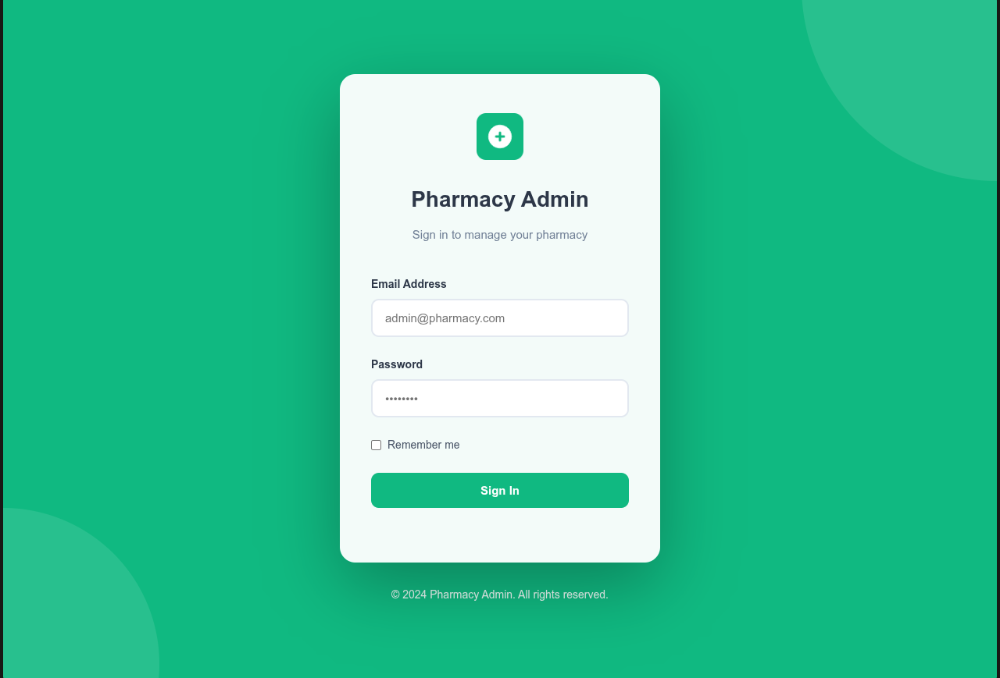
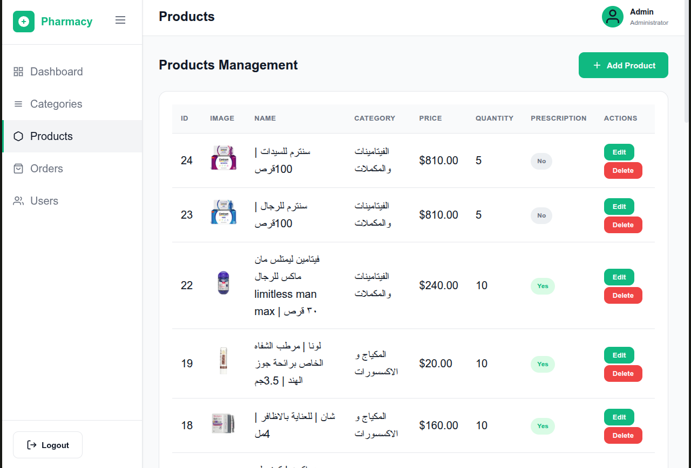
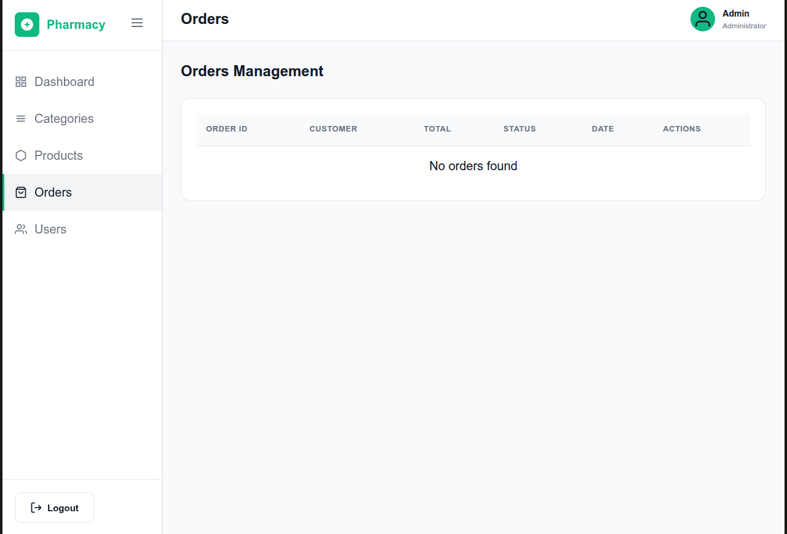

#### Dashboard Features
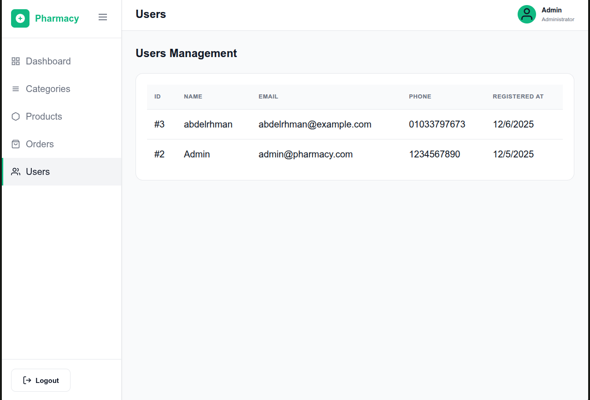
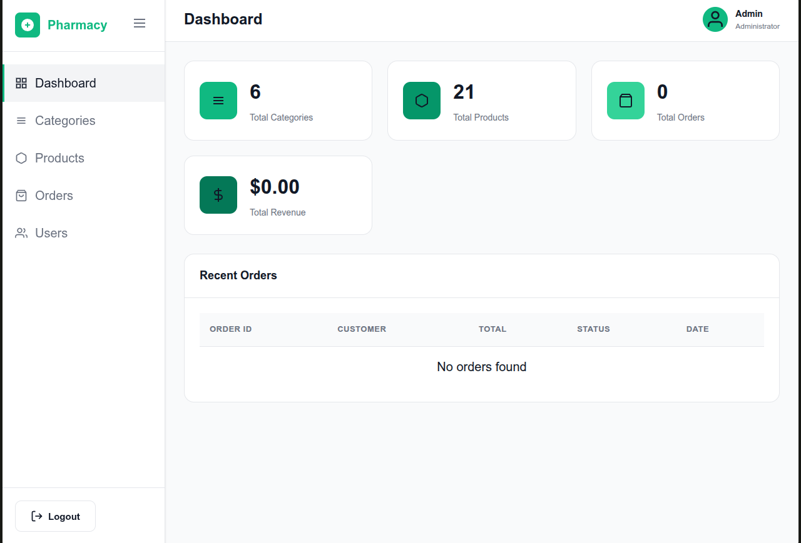
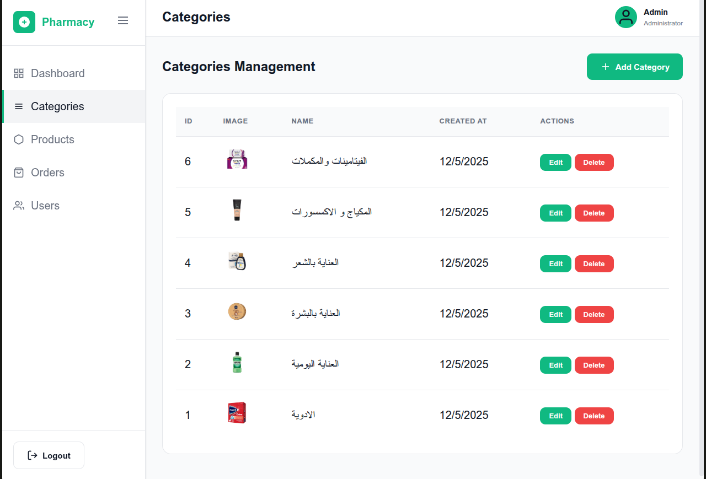

</div>

### 📸 App Screenshots

<div align="center">

#### Home & Products
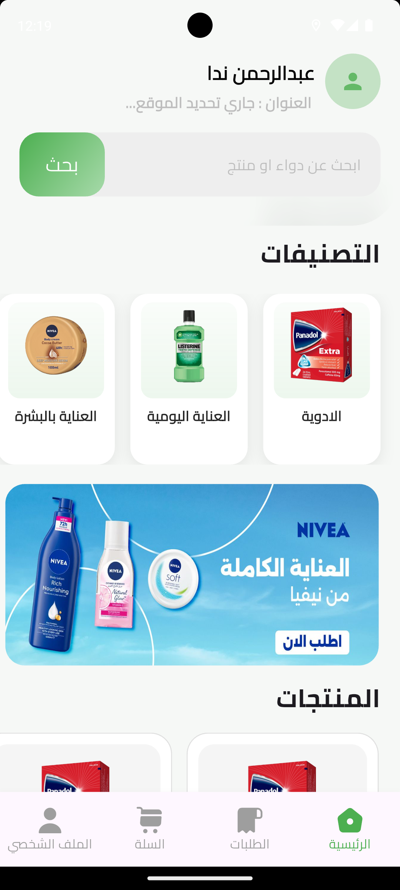
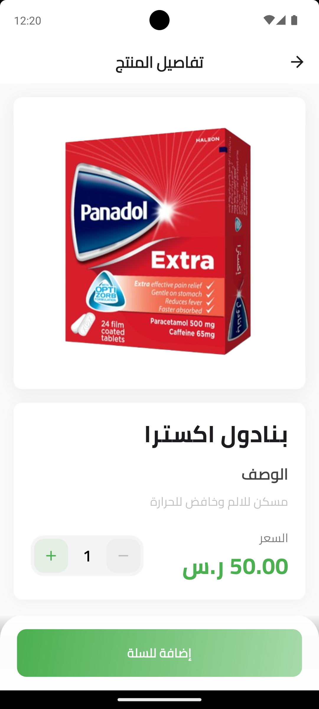

#### Categories & Search
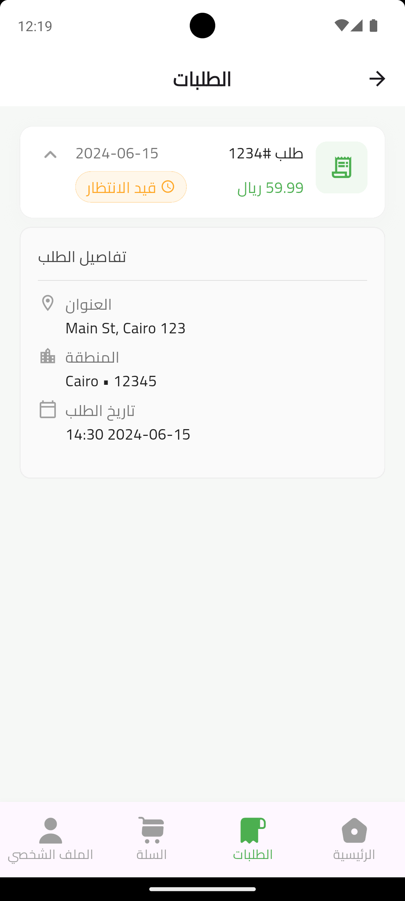


#### Cart & Orders
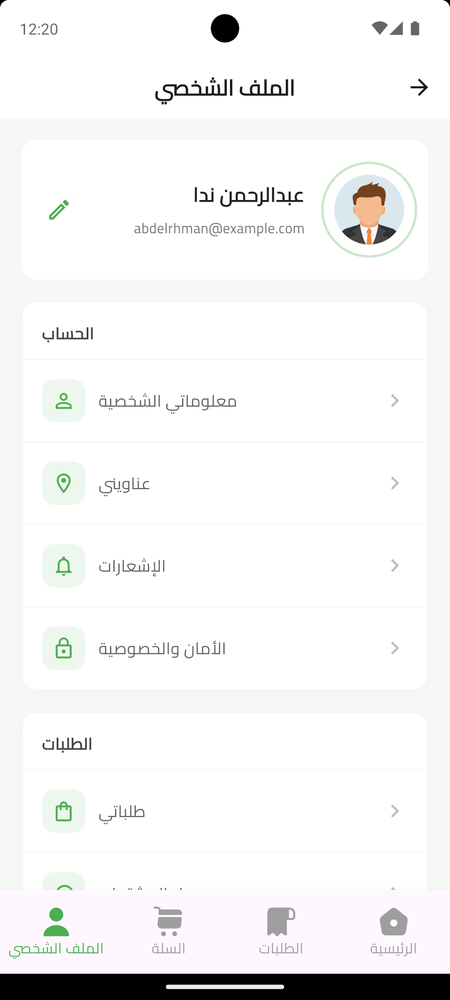
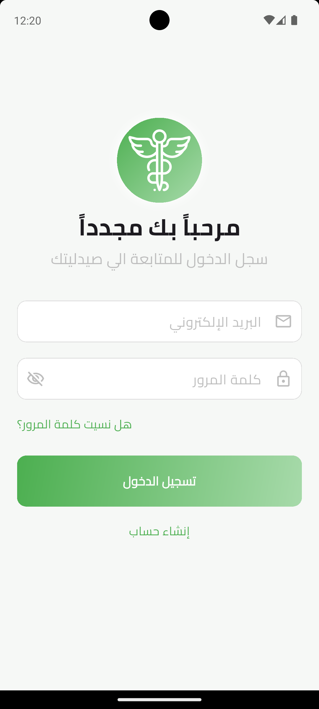

#### Profile
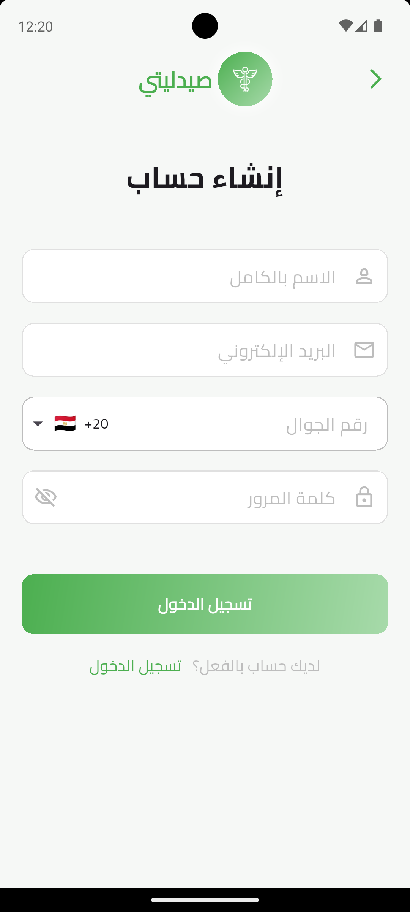

</div>

---

## 🏗️ Architecture

The app is built on Clean Architecture with layer separation:

### Presentation Layer
- **Screens**: App screens
- **Widgets**: Reusable widgets
- **BLoC**: State management

### Data Layer
- **Models**: Data models
- **Repositories**: Data repositories
- **Data Sources**: Data sources (API, Local)

### Core Layer
- **Utils**: Utilities
- **Services**: Shared services
- **Routing**: Routing system
- **Widgets**: Shared widgets

---

## 🔧 Configuration

### Colors
You can customize app colors from `lib/core/utils/app_colors.dart`

### Fonts
Default font: **Cairo** (can be changed from `pubspec.yaml`)

### Language
The app supports Arabic by default with the ability to add other languages

---

## 📝 Development

### Adding a New Feature

1. Create a new folder in `lib/features/`
2. Follow the structure:
```
feature_name/
├── data/
│   ├── models/
│   └── repositories/
└── presentation/
    ├── screens/
    └── widgets/
```

### Adding a New Page to Dashboard

1. Add the page in `lib/features/main_screen/main_screen.dart`
2. Add a new icon in `BottomNavigationBar`
3. Update the `_screens` list

---

## 🤝 Contributing

Contributions are welcome! Please follow these steps:

1. Fork the project
2. Create a feature branch (`git checkout -b feature/AmazingFeature`)
3. Commit your changes (`git commit -m 'Add some AmazingFeature'`)
4. Push to the branch (`git push origin feature/AmazingFeature`)
5. Open a Pull Request

### Code Standards
- Use clear names for variables and functions
- Write comments for complex code
- Follow project architecture
- Test code before pushing

---

## 📄 License

This project is licensed under the [MIT License](LICENSE)

---

## 👨‍💻 Developer

**Abdelrhman Nada**

- GitHub: [@Abdelrhman-Tec](https://github.com/Abdelrhman-Tec)
- LinkedIn: [Abdelrhman Nada](https://linkedin.com/in/abdelrhman-nada)

---

## 🙏 Acknowledgments

- Flutter Team for the amazing framework
- Arabic community for support and help
- All project contributors

---

<div align="center">

**⭐ If you like the project, don't forget to give it a star! ⭐**

Made with ❤️ by Abdelrhman Nada

</div>
